# Performance Analysis

**Goal:** Evaluate the impact of optimizations on rendering and user interactions. Metrics were measured using React DevTools Profiler and Performance tools.

The application underwent 3 optimization stages:

1. **Before optimization:** Rendering all data at once (the table with details for all countries is fully rendered).
2. **After optimizing `details`:** The table with country data is rendered only when the details are opened (lazy rendering).
3. **After adding memoization:** Using `useMemo` and `useCallback` to prevent unnecessary re-renders (memoization of functions and context).

---

## Commit Duration

1. **Before optimization:** High time due to full rendering of all components on every change.

- `Committed at` – 3700 ms
- `Render` – 1086.5 ms

2. **After optimizing details:** Reduced by ~50% because the table renders only when needed.

- `Committed at` – 1800 ms
- `Render` – 37.3 ms

3. **After adding memoization:** No change, as memoization does not affect commit time but prevents unnecessary re-renders.

- `Committed at` – 1800 ms
- `Render` – 8.3 ms

---

## Render Duration

1. **Before optimization:** The main bottleneck was the `Country` components rendering for all countries.

- `Main` – 1.6 ms
- `CountriesList` – 15.8 ms
- `Country` – max 51.5 ms, min 0.2 ms

2. **After optimizing details:** Improvement of 97% thanks to lazy rendering — components render only on interaction.

- `SelectYear` – 14.8 ms
- `Widget` – 6.4 ms
- `Main` – 4.3 ms
- `CountriesList` – 1.8 ms
- `Country` – < 1 ms

3. **After adding memoization:** Improvement of 78% compared to the previous stage. Memoization prevented re-renders of dependent components.

- `Country` – max 1.1 ms
- `CountriesList` – 0.8 ms
- `Main` – 0.4 ms
- `Widget` – 0.3 ms
- `SelectYear` – ~0.1 ms
- `Widget` – ~0.1 ms
- `Main` – ~0.1 ms

---

## Interactions

### Tested interactions:

1. **Before optimization:**

- Country search: 3309 ms
- Year selection: 507 ms
- Widget apply: 626 ms

2. **After optimizing details:**

- Country search: 44 ms
- Year selection: 37 ms
- Widget apply: 239 ms

3. **After adding memoization:**

- Country search: 23 ms
- Year selection: 30 ms
- Widget apply: 209 ms

---

## Flame Graphs and Ranked Charts

1. **Before optimization:**  
  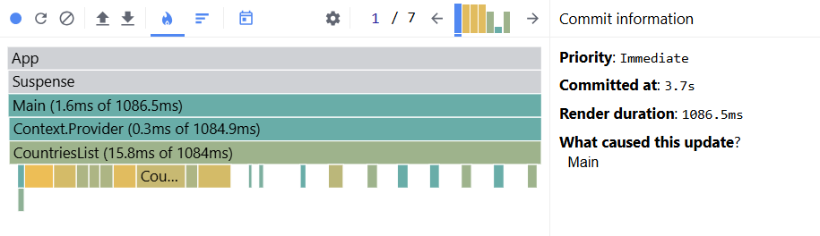
  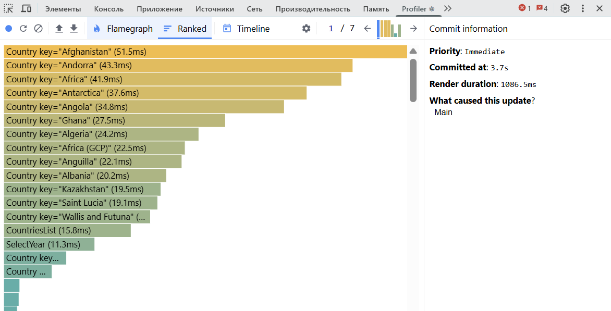 
  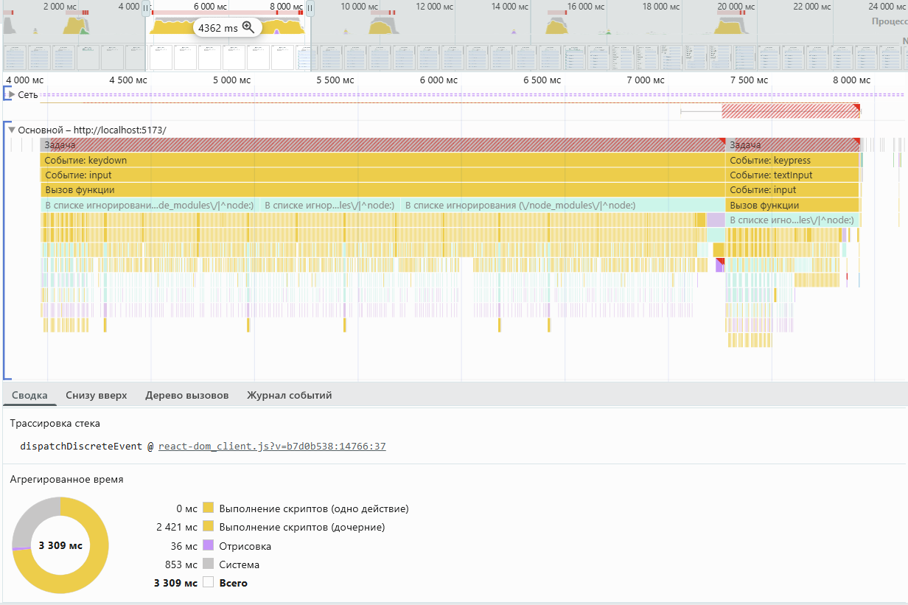 
  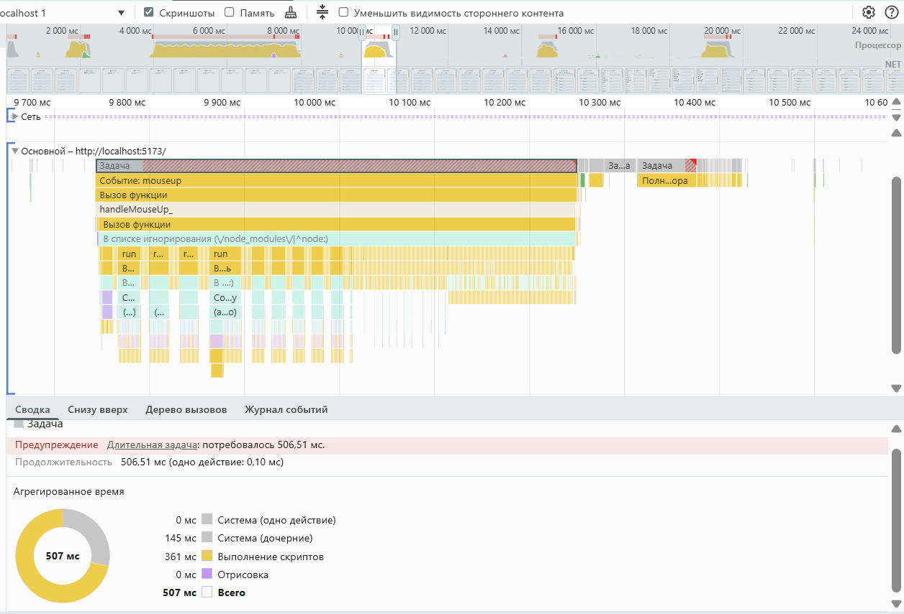 
  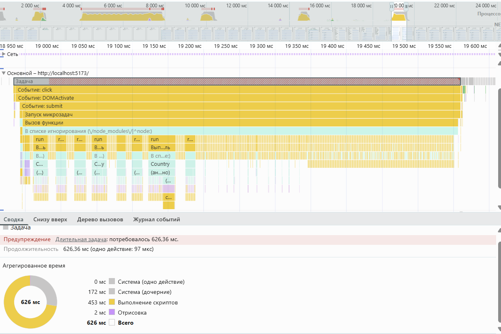

2. **After optimizing details:**  
   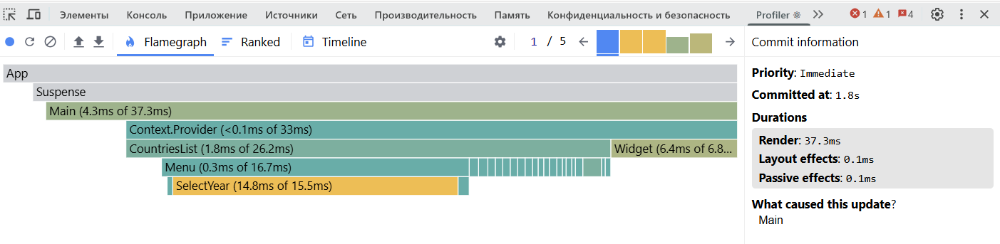
   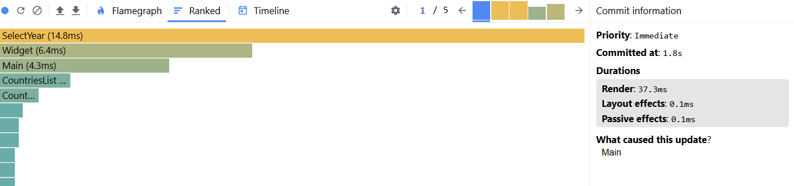 
   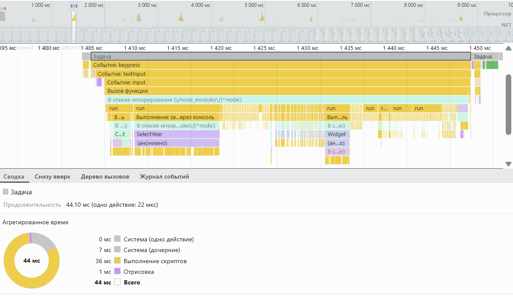 
   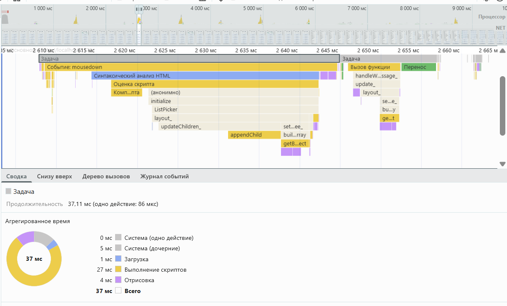 
   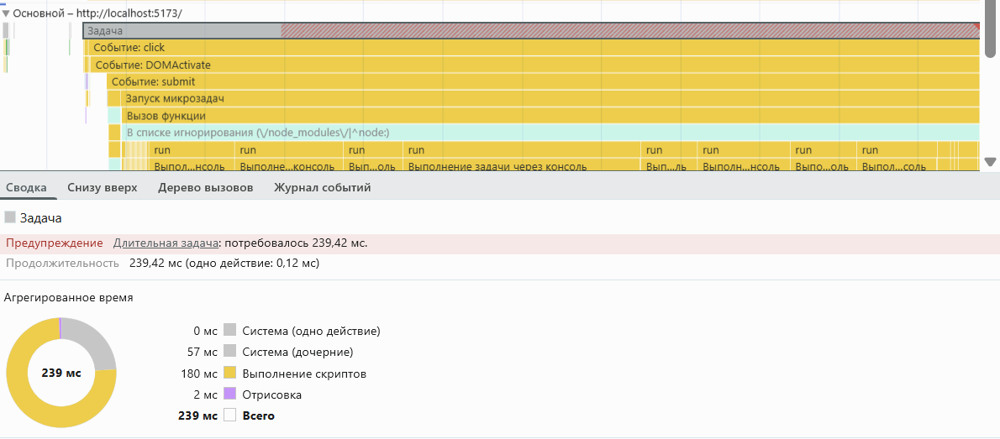

3. **After adding memoization:**  
   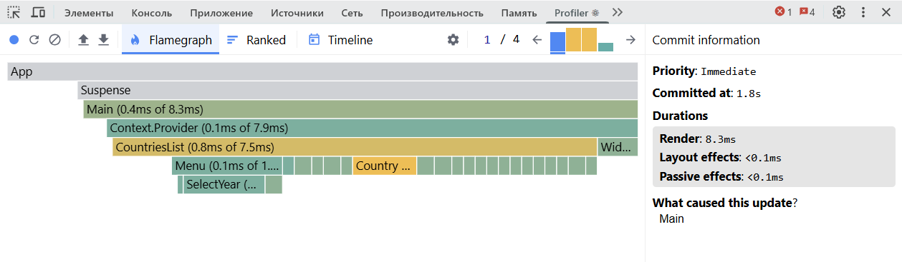
   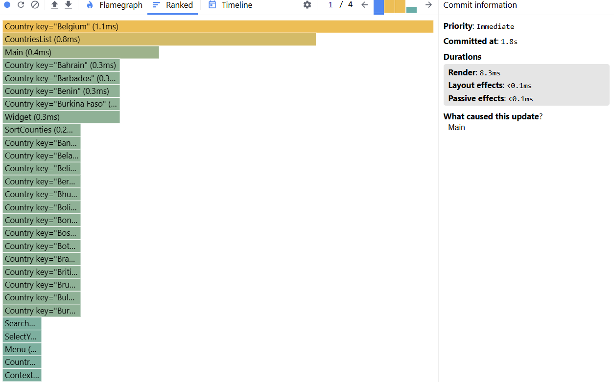 
   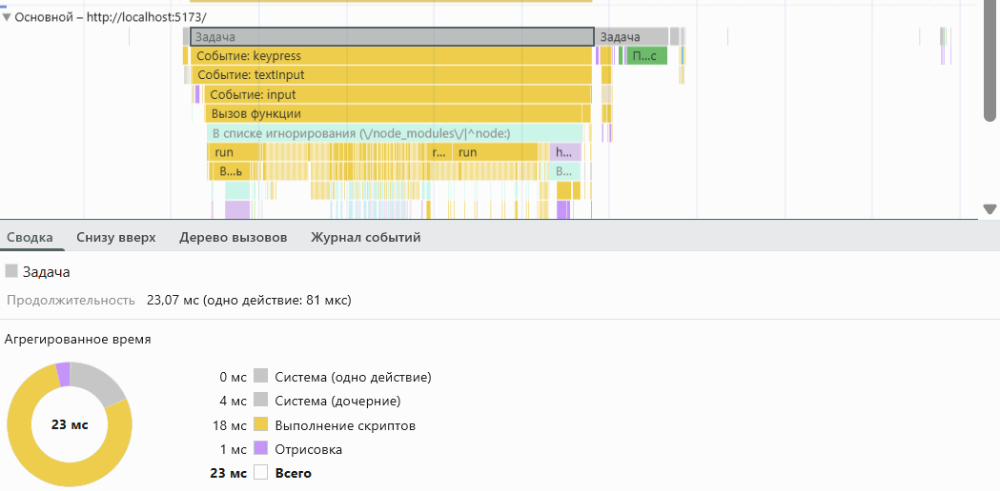 
   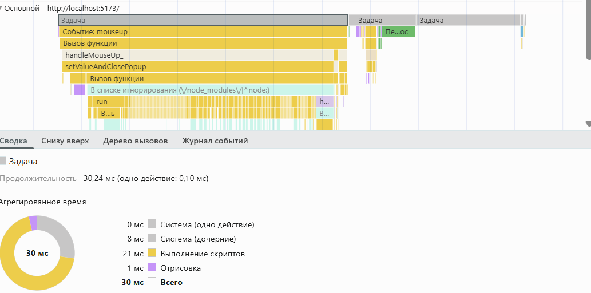 
   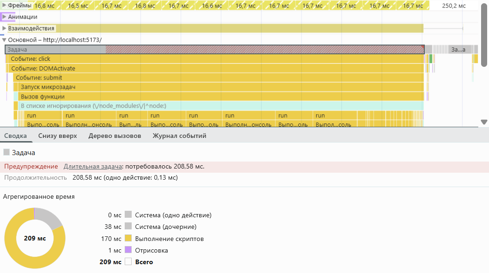